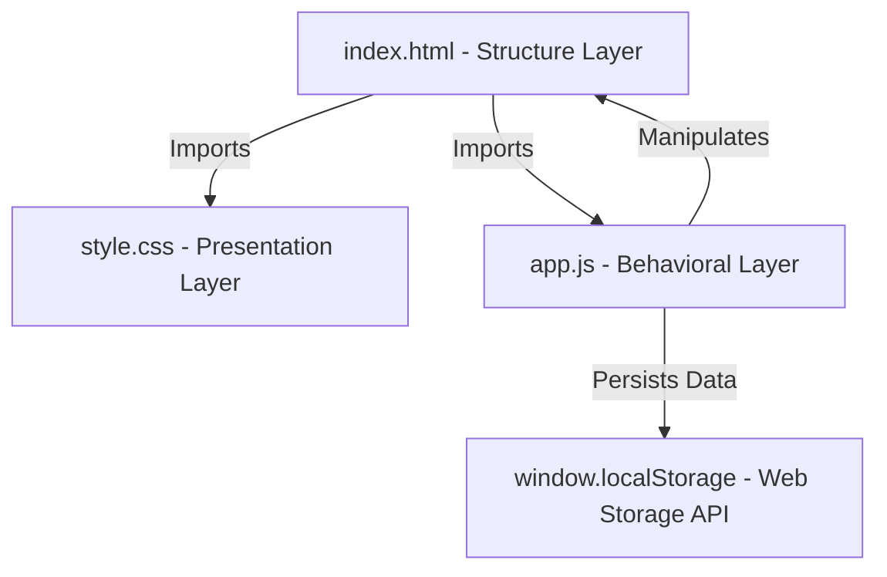

# SMART SHOP - High-Fidelity Frontend E-Commerce Platform
### B.Tech Computer Science & Engineering (Final Semester Project)

**Developed by:** Anhud Singh Kondal  
**Academic Specialization:** Computer Science & Engineering  
**Tech Stack:** HTML5, CSS3 (Vanilla), ES6+ JavaScript  
**Repository Directory:** `/smart-shop`

---

## 📝 Project Abstract

**Smart Shop** is a high-fidelity, fully responsive e-commerce storefront designed for modern, web-based apparel distribution. The project is engineered purely using native web technologies (HTML5, CSS3, and Vanilla JavaScript) to showcase solid software engineering design patterns, client-side state management, and optimized asset delivery without the overhead of heavy third-party framework dependencies.

The platform provides a smooth shopping experience featuring dynamic filtering, live search queries, a persistent state-driven sliding cart drawer, an authentication module, an interactive billing checkout simulation, and a dedicated academic evaluation portfolio slide.

---

## 🛠️ Technology Stack & Architectural Overview

The application utilizes a modular, decoupled frontend architecture dividing concerns into Structure, Styling, and State:



### 1. Structure Layer (`index.html`)
* **Semantic HTML5 Layouts**: Employs `<header>`, `<main>`, `<section>`, and `<footer>` tags to guarantee search engine optimization (SEO) compliance, clear document outlines, and accessibility.
* **Inline Vector SVGs**: Leverages native, scalable vector graphics for brand icons and action triggers to ensure crisp, lightning-fast rendering across all screen densities.
* **Modal Shells**: Embedded, decoupled structure boundaries containing independent login forms, checkout details, quick-views, and project portfolio slides.

### 2. Presentation Layer (`style.css`)
* **Design Tokenization**: Employs CSS custom properties (`:root { --primary: ... }`) to govern color schemes, border radii, shadows, and smooth transition timings in a unified registry.
* **Modern Responsive Grid & Flex Layouts**: Leverages flexible layouts to create responsive designs that adapt dynamically from 4K desktops to narrow mobile screens without breaking aesthetics.
* **Glassmorphism & Micro-animations**: Employs elegant backdrop filters (`backdrop-filter: blur()`) and keyframe animations (`@keyframes`) for cart slides, loading transitions, and subtle card hover expansions.

### 3. Application State Layer (`app.js`)
* **State Management Model**: Controls shopping cart arrays (`cart = []`), active categories, live search strings, and dialog states using dedicated event hooks.
* **DOM Rendering Engine**: Clears and builds product catalog elements dynamically from a centralized JS memory cache, ensuring high performance.
* **Standard Web Caching**: Integrates the native browser `window.localStorage` API to cache cart items securely, persisting states across page refreshes.

---

## 🔬 Core Computer Science & Engineering (CSE) Concepts Demonstrated

When presenting this project to your evaluator, you can highlight these key technical implementations:

### A. Client-Side State Persistence
The system implements state persistence using standard browser cookies/web storage APIs. By hooking cart update functions to modern local storage, data remains persistent across page lifecycles:
```javascript
function saveCartToStorage() {
    localStorage.setItem("smart_shop_cart", JSON.stringify(cart));
}
```

### B. Event-Driven Asynchronous Programming
The behavioral layer listens to user triggers using passive and active asynchronous callback event bindings. Standardizing events like text search inputs ensures immediate UI responsiveness:
```javascript
searchInput.addEventListener("input", (e) => {
    searchQuery = e.target.value.toLowerCase().trim();
    renderProducts(); // Re-renders filter catalog dynamically
});
```

### C. Client-Side Mathematical Computations
Simulates transaction billing dynamically. When cart actions occur, the application aggregates product quantities, maps unit prices, applies a mock **8% sales tax (GST)**, and updates the structural DOM totals cleanly:
$$\text{Total} = \sum (\text{Price} \times \text{Quantity}) \times 1.08$$

---

## 📂 Project Directory Structure

```text
smart-shop/
│
├── index.html      # Central skeleton, semantic tags, structures, and modal windows
├── style.css       # Global design variables, layout grids, animations, and transitions
├── app.js          # Product datasets, state loops, cart events, and storage caching
└── README.md       # Technical academic project documentation (This file)
```


## 🚀 Easy Run & Deployment Instructions

No compiler, package installation, or host server environments are required to launch this application:

### Option 1: Direct File Launch
1. Double-click the **`index.html`**.
2. The site will boot immediately in your system's default internet browser.

### Option 2: Live Local Server
1. Open the project folder in VS Code.
2. If the **Live Server** extension is installed, click **"Go Live"** on the bottom status bar.
3. The page runs locally on `http://localhost:5500`.
